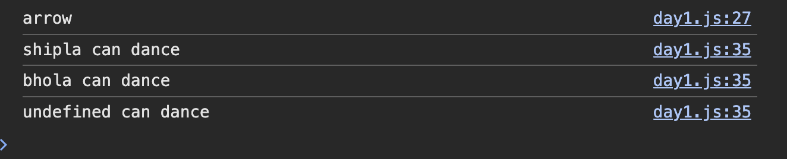
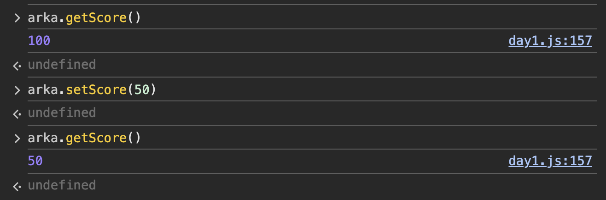
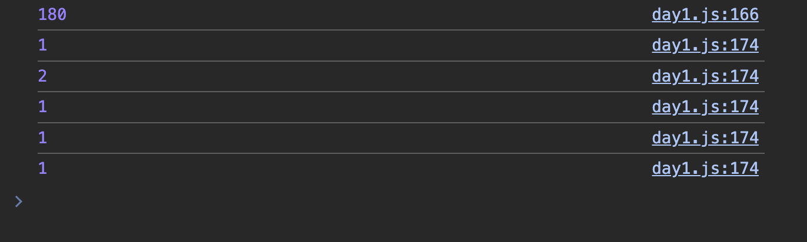
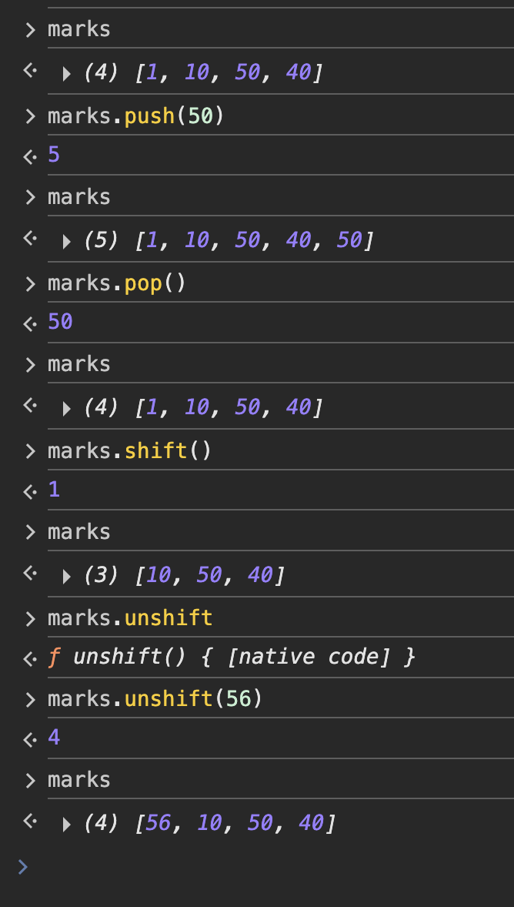
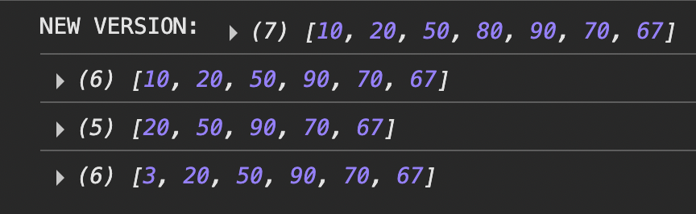
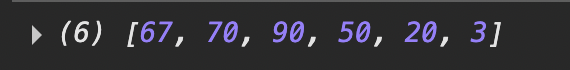
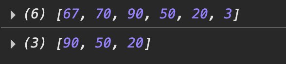
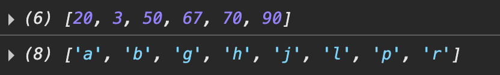

this Happens when there is no value provided to a function that demands an argument to be sent to it.

# Functions:

### Q1. What is the difference in function expression and declaration with reference to hoisting?

### Q2. WHat is the argument and parameter of a function?

### Q3. What does the '...' operator mean in parameters?

### Q4: A function that does not returns anything returns undefined..

### Q5. What does it mean to say Functions are first-class citizens?

-> This is because our functions can be treated as values, can be stored in variables, can be passed in arguments.

### Q6. What is a higher Order function?

-> These are fns which can return a function or accept a function in its parameter

### Q7. What is a Closure? When it is created?

-> Closure is a function that returns another function and the child function can use the parameters of the parent function.
-> When a function "remembers" and can use variables from its outer (parent) scope even after that outer function has finished executing.

### ⚡ Think of it like this:

outer() built a backpack that contains count.
The inner function carries that backpack with it wherever it goes.
Every time you call counter(), it looks inside its backpack, updates count, and uses it.

### Q. what is the use of IIFE ? Give one real time use case ?

-> We use IIFEs when we are ceating private variables, which we dont want to be called from anywhere.
-> If there is any vakue that we dont want to be updated then we can do this.

let arka = (function () {
let score = 100;
return {
getScore: function () {
console.log(score);
},

    setScore: function (val) {
      score = val;
    },

};
})();



## This is a classical example of closures.

-> How the child functions can remember the value of their parents.
-> Everytime we use the function created out of counter they retain the value of count.
-> But if we were to use the main function counter() then a new count would be initialized each time.

### Counter

function counter() {
let count = 0;
return function () {
count++;
console.log(count);
};
}

let count1 = counter();
count1();
count1();

let count2 = counter();
count2();

counter()();



Confusion: Arrow and normal Function.

## Temporal Dead Zone?

-> when we are using var if our value is not declared earlier then it gives undefined.
-> But in case of let and const if it is not declared then it stays in the temporal dead zone, and cannot be used until we define the value.

### Temporal Dead Zone (TDZ)

The **Temporal Dead Zone (TDZ)** is the time between entering a scope and the actual variable declaration, during which accessing a `let` or `const` variable will throw a **ReferenceError**.

---

### `var` behavior

- `var` declarations are **hoisted** to the top of their scope.
- They are **initialized with `undefined`** right away.
- Accessing them before their declaration does **not** throw an error, but gives `undefined`.

```js
console.log(a); // undefined ✅ (but risky)
var a = 10;
```

```js
console.log(b); // ❌ ReferenceError (TDZ)
let b = 20;
```

```js
console.log(c); // ❌ ReferenceError (TDZ)
const c = 30;
```

### Difference between HOF and Closures?

-> HOFs return function inside function and same is done by the Closures, but the diff. lies in that for it to be called a Closure, the inner function should make use of some variable of the parent function. Then the parent function would be called a closure.

## Arrays

### Methods: `push`, `pop`, `shift`, `unshift`, `splice`, `slice`, `reverse`, `sort`

### Other: `map`, `filter`, `reduce`, `find`, `some`, `every`

### Desctructuring

### Functions demo: `push`, `pop`, `shift`, `unshift`



### Functions demo: splice, shift, unshift

```js
marks.splice(3, 1); // This starts removing the element from 3rd index, and exactly removes '1' index since it is given as 1 in the second parameter.
console.log(marks);

marks.shift(); // This removes the first element of the array
console.log(marks);

marks.unshift(3); // This adds a specified element at the beginning of the array
console.log(marks);
```



### Functions demo: reverse

```js
marks.reverse(); // This reverses the array
console.log(marks);
```



### Slice Function

```js
let new_marks = marks.slice(2, 5); // Doesn't overwrites the main array but slices the main array and places it in the new declared array
// Including the first index and excluding the ending index
console.log(new_marks);
```



```js
marks.sort(); // Marks is sorted based on string comparison default
console.log(marks); // [20, 3, 50, 67, 70, 90]
// Hence we can feel that the order is sort of different but its that 2 comes before 3 then 4 then 5 then 6 then 7 ... 2 -> 3 -> 5 -> 6 -> 7 -> 9

let alpha = ["g", "h", "l", "r", "a", "b", "j", "p"]; // alpha is based on string comparison by default hence it is sorted by default
console.log(alpha.sort());
```


